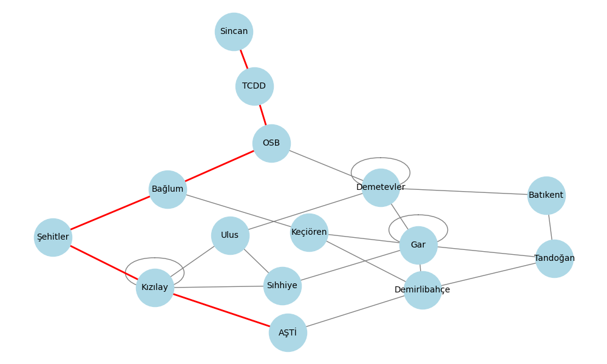
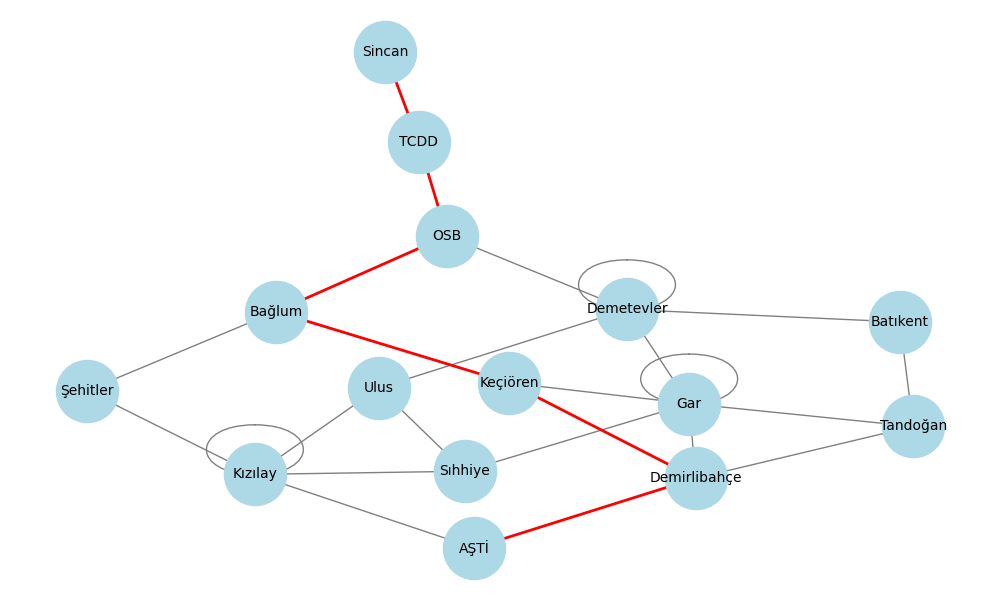
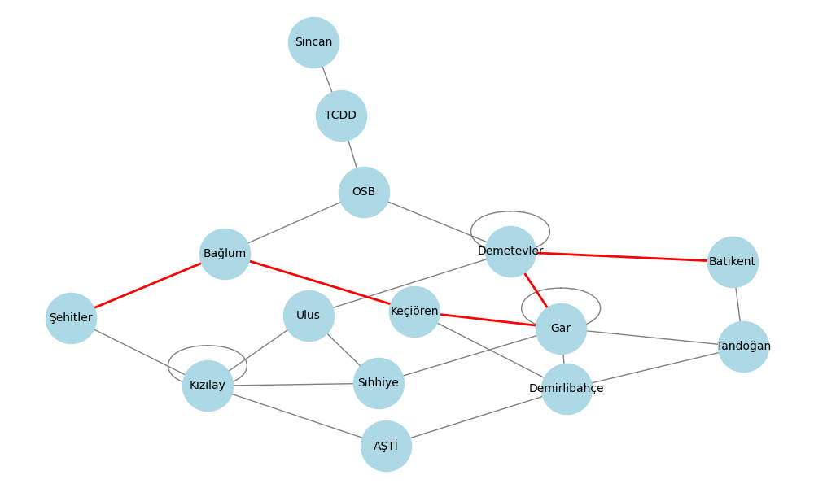
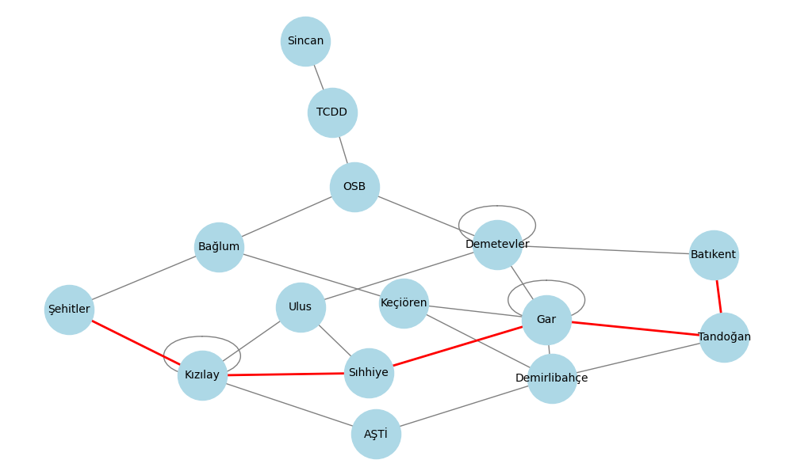

# Metro Rota Simulasyonu
---
Proje
---
Bu proje, bir metro ağı üzerinde istasyonlar arasındaki en hızlı ve en az aktarmalı rotayı bulmaya yönelik bir rota planlayıcıdır. Kullanıcılar, bir başlangıç ve hedef istasyonu belirleyerek, metro hattındaki en uygun rotayı hesaplayabilirler. Hem en hızlı rota hem de en az aktarmalı rota seçenekleri sunulmaktadır.

Proje, BFS (Breadth-First Search) ve A* algoritmalarını kullanarak bu hesaplamaları yapar ve sonuçları görsel bir şekilde sunar.


---
## Kullanılan Teknolojiler ve Kütüphaneler

- **NetworkX**: Metro ağının grafiksel olarak görselleştirilmesi için kullanılan bir kütüphanedir. Metro istasyonları ve bağlantıları bir grafik yapısına dönüştürülerek görselleştirilir.
- **Matplotlib**: NetworkX tarafından üretilen grafikleri görsel olarak sunmak için kullanılan bir kütüphanedir.
- **Collections**: Python'un deque yapısı, BFS algoritmasında kuyruğun verimli şekilde kullanılmasını sağlar.
- **Heapq**: A* algoritmasında öncelik kuyruğu (min-heap) oluşturmak için kullanılır, bu da en düşük toplam süreyi bulmamıza yardımcı olur.
- **Dict, List, Tuple, Optional**: Pythondaki çeşitli veri yapılarıdır.
    ```
    Dict: Dict genel olarak anahtar (key) ve değer (value) çiftlerini tutar.
    Örnek:
    my_dict: Dict[str, int] = {'a': 1, 'b': 2}

    List: Bir dizi elemanı tutan veri yapısını belirtir.
    Örnek:
    my_list: List[int] = [1, 2, 3, 4]

    Tuple: Sıralı ve değiştirilemez bir koleksiyon tutar. Bu koleksiyonun elemanlarının tipleri de belirtilebilir. Birden fazla veri tipi içerebilir.
    Örnek:
    my_tuple: Tuple[int, str, float] = (1, "hello", 3.14)

    Optional: Genellikle fonksiyon parametrelerinde veya dönüş değerlerinde bir değerin isteğe bağlı olduğunu belirtmek için kullanılır. Bu, değerin ya belirtilen tipte olabileceğini ya da None olabileceğini ifade eder. Optional aslında Union[X, None] şeklinde bir eşdeğeri ifade eder.
    Örnek:
    def ornek_optional(x: Optional[int]) -> None:
    if x is not None:
        print(f"Verilen değer: {x}")
    else:
        print("Değer sağlanmadı")
    ```
---
## Algoritmaların Çalışma Mantığı
---
## _BFS Algoritması_

BFS (Breadth-First Search), yani Genişlik-Öncelikli Arama, bir graf veya ağaç üzerinde yapılan, belirli bir başlangıç noktasından başlayarak, tüm düğümlere (ya da nodlara) ulaşmayı amaçlayan bir arama algoritmasıdır. BFS, sırasıyla komşu düğümlere (yani, aynı seviyede olan düğümlere) ulaşır ve her seviye tamamlandıkça bir sonraki seviyeye geçer.

### Nasıl Çalışır?
- Başlangıç istasyonunu kuyruğa ekleriz.
- Kuyruk boşalana kadar, her bir istasyonun komşularına giderek, her adımda en az aktarma yaparak hedefe ulaşmaya çalışırız.
- İlk hedefe ulaşıldığında, en az aktarmalı rota bulunmuş olur.


---
## _A* Algoritması_

A algoritması*, daha verimli bir yol arama algoritmasıdır. A* algoritması, her bir adımda hem toplam yol uzunluğunu (g-cost) hem de hedefe olan tahmini mesafeyi (h-cost) kullanarak, en kısa ve en hızlı rotayı bulur.

### Nasıl Çalışır?
- Başlangıç istasyonundan hedefe kadar olan yol, her adımda hedefe en yakın istasyonları seçerek ilerler.
- A* algoritması, her bir istasyon için toplam tahmin edilen süreyi hesaplar ve bu tahminlere göre en uygun istasyonu seçer.
- Tahmini kalan mesafe h-cost olarak kabul edilir, ancak basit bir değer olarak şu anda 0 kabul edilmiştir.


### Neden Bu Algoritmalar Tercih Edildi?

- **BFS Algoritması**: Bu algoritma, her adımda tüm komşu istasyonları ziyaret ederek, en kısa aktarmalı rotayı bulmak için basit ama etkili bir yöntem sunar. Bu, aktarmalı rotalar için ideal bir algoritmadır.

- **A star Algoritması**: Bu algoritma, özellikle daha hızlı rotalar arandığında çok etkilidir. Hedefe olan tahmini mesafeyi dikkate alarak daha kısa sürede optimal rotayı bulmamıza yardımcı olur.
---
## Örnek Kullanım ve Test Sonuçları

### Senaryo 1: AŞTİ'den Sincan'a
```
rota = metro.en_az_aktarma_bul("M1", "K6")
    if rota:
        print("En az aktarmalı rota:", " -> ".join(i.ad for i in rota))
        metro.metro_grafik(rota)

sonuc = metro.en_hizli_rota_bul("M1", "K6")
    if sonuc:
        rota, sure = sonuc
        print(f"En hızlı rota ({sure} dakika):", " -> ".join(i.ad for i in rota))
        metro.metro_grafik(rota)

=== Senaryo 1 Sonucu ===

1. AŞTİ'den Sincan'a:
En az aktarmalı rota: AŞTİ -> Kızılay -> Şehitler -> Bağlum -> OSB -> TCDD -> Sincan
En hızlı rota (42 dakika): AŞTİ -> Demirlibahçe -> Keçiören -> Bağlum -> OSB -> TCDD -> Sincan
```
### _En az aktarmalı rota_

---
### _En hızlı rota_



### Senaryo 2: Batıkent'ten Şehitler'e
```
rota = metro.en_az_aktarma_bul("T1", "T6")
    if rota:
        print("En az aktarmalı rota:", " -> ".join(i.ad for i in rota))
        metro.metro_grafik(rota)
    
sonuc = metro.en_hizli_rota_bul("T1", "T6")
    if sonuc:
        rota, sure = sonuc
        print(f"En hızlı rota ({sure} dakika):", " -> ".join(i.ad for i in rota))
        metro.metro_grafik(rota)

=== Senaryo 2 Sonucu ===

2. Batıkent'ten Şehitler'e:
En az aktarmalı rota: Batıkent -> Demetevler -> Gar -> Keçiören -> Bağlum -> Şehitler
En hızlı rota (26 dakika): Batıkent -> Tandoğan -> Gar -> Gar -> Sıhhiye -> Kızılay -> Şehitler
```
### _En az aktarmalı rota_

---
### _En hızlı rota_


## Projeyi Geliştirme Fikirleri

- Gerçek Zamanlı Veriler: Gerçek zamanlı metro bilgileri (örneğin, gecikmeler ve duraklar) eklenebilir ve A* algoritması buna göre dinamik olarak rotaları güncelleyebilir.

- Farklı Grafikleri Destekleme: Metro ağının daha farklı görselleştirme teknikleriyle sunulması, kullanıcı deneyimini geliştirebilir.

---

<h2 align="center">Değerli Katkılar İçin Teşekkürler</h2>

<p align="center">
  <a href="https://www.linkedin.com/in/rumeysa-bakar-789b311b3/" target="_blank">
    
  </a>
  &nbsp;
  <a href="https://www.globalaihub.com/" target="_blank">
    
  </a>
</p>
<p align="center">
  <em style="font-size: 14px; color: #555;">Destekleri ve sağladıkları kaynaklar için teşekkürler.</em>
</p>

---

<h2 align="center">Geliştirme ve Düzenleme: Mahmut Furkan YILDIRIM</h2>

<p align="center">
  <a href="https://github.com/MahmutFurkanYildirim" target="_blank">
    
  </a>
  &nbsp;
  <a href="https://www.linkedin.com/in/furkany%C4%B1ld%C4%B1r%C4%B1m9/" target="_blank">
    
  </a>
</p>

<p align="center">
  <em style="font-size: 14px; color: #555;">Bu projeyi incelediğiniz için teşekkürler.</em>
</p>

---

